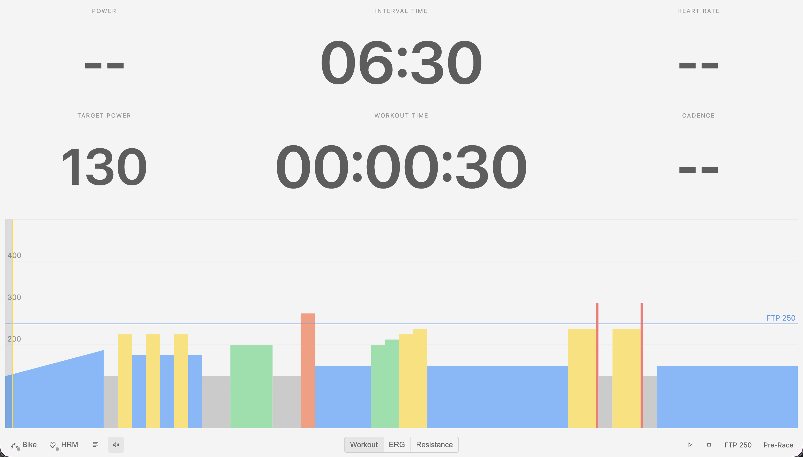
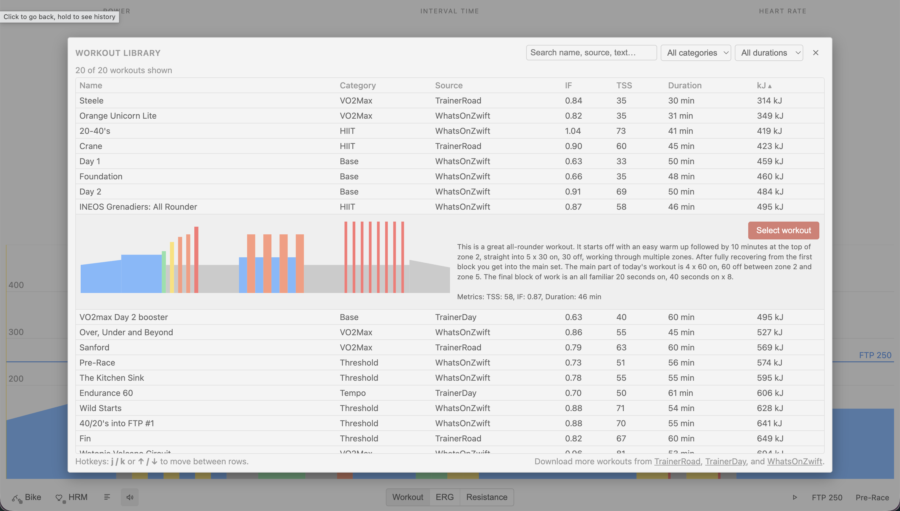

<p align="center">
  
</p>

# VeloDrive

VeloDrive is a lightweight Chrome extension / PWA that helps you build your own library of structured cycling workouts and ride them indoors on a smart trainer — entirely in the browser. You can grab workouts from [WhatsOnZwift](https://whatsonzwift.com/workouts), [TrainerDay](https://app.trainerday.com/workouts), and [TrainerRoad](https://www.trainerroad.com/app/cycling/workouts) (members only) save them into a local folder, and run them using a clean workout interface with ERG control, Bluetooth FTMS support, and automatic workout recording.

No backend. No accounts. No dependencies. Just your browser, your trainer, and your workouts.

<picture>
  <source media="(prefers-color-scheme: dark)" srcset="docs/hero-dark.png">
  
</picture>


## Features

- Download structured workouts from TrainerRoad, TrainerDay, and WhatsOnZwift as `.zwo` file
- Normalize intervals, detect repeated sets, and compute **IF**, **TSS**, **kJ**, and duration
- Store your workout library locally using the File System Access API
- Connect directly to smart trainers and HR straps over Web Bluetooth
- Run structured workouts with ERG control, interval countdowns, and auto-pause
- View a live chart with power, HR, cadence, and power targets
- Save completed workouts as local JSON files for analysis
- 100% local-first: no server calls or data sharing

## Quick Start

### Install

1. Clone the repo:
```sh
git clone https://github.com/babymastodon/velo-drive.git
````

2. Open Chrome → `chrome://extensions`
3. Enable **Developer mode**
4. Click **Load unpacked…** and select the project folder

No build step — the app runs as plain HTML/JS.

### Download a workout

Open a supported workout page, click the extension icon, and it will:

* Detect the site
* Extract or fetch the workout structure
* Convert it into a clean `.zwo` file with tags and metrics
* Save it into your chosen folder (or fall back to your Downloads directory)

### Ride it

Open the workout runner page from the extension menu.
Choose a `.zwo` from your library, connect your trainer and HR strap, set your FTP, and click **Start**.
A countdown begins, ERG targets are applied, and the chart + metrics update in real time.
When finished, a JSON file with your entire ride is written to your history folder.

<picture>
  <source media="(prefers-color-scheme: dark)" srcset="docs/selector-dark.png">
  
</picture>

## Supported Platforms

The main purpose of this project is to provide a **modern indoor cycling experience on Linux** using Chrome or another Chromium-based browser. Linux is the primary target platform.

Because it relies only on Web Bluetooth, the File System Access API, and modern JS, it may work on:

* Windows
* macOS
* ChromeOS
* Android

iOS Safari does not support the required APIs.

## Smart Trainer Support

The workout runner uses standard Bluetooth **FTMS** for trainer control and **Heart Rate** service for HR straps.

It has been **tested on**:

* **Wahoo KICKR (modern models)** — ERG + resistance
* **Wahoo TICKR** — heart rate

It will likely work with any trainer that advertises FTMS, including popular devices such as:

* Tacx NEO / Flux (FTMS BLE mode)
* Elite Direto / Suito
* Saris H3
* JetBlack Volt
* Other FTMS-compliant smart trainers

If a trainer exposes FTMS Indoor Bike Data + Control Point characteristics, it should function.

## Development

This entire app was **vibe-coded with ChatGPT**, so there are *very few guarantees* about the code being tidy, consistent, idiomatic, or even sensible. It works — but approach it with a sense of adventure.

There is no build system. Everything runs as plain JavaScript, HTML, and CSS.
Reload the extension via `chrome://extensions` to see any changes.

## Contributing

Contributions are welcome — especially those aimed at **refactoring the AI-slop** into something more maintainable and pleasant to work with.

Improving readability, organization, device support, or the UX would all be meaningful contributions.

## License

MIT
