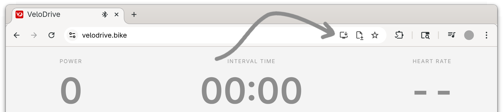

<p align="center">
  <a href="https://velodrive.bike/">
    
  </a>
</p>

# VeloDrive

VeloDrive is a lightweight **Progressive Web App (PWA)** and optional **Chrome extension** for creating, organizing, and riding structured cycling workouts on FTMS-compatible smart trainers like the [Wahoo Kickr](https://www.wahoofitness.com/devices/indoor-cycling/bike-trainers) or [Tacx Neo](https://www.garmin.com/en-US/c/sports-fitness/indoor-trainers/)

You can open the app directly at:

👉 **https://velodrive.bike/**

The PWA works offline, installs locally, and runs entirely in the browser with no accounts or backend.

<picture>
  <source media="(prefers-color-scheme: dark)" srcset="docs/screenshots/hero-dark.png">
  
</picture>

## Installation

### Web App (recommended)

Open:

**https://velodrive.bike/**

In **Google Chrome**, you’ll see an **Install** icon in the address bar.
Click it to install VeloDrive as an app. It will appear in your system’s app launcher and can run offline once installed.

<picture>
  <source media="(prefers-color-scheme: dark)" srcset="docs/screenshots/install_dark.png">
  
</picture>

### Chrome extension (optional)

The extension is not required for riding workouts.
It simply makes it easier to **download workouts** as .zwo files directly from
[WhatsOnZwift](https://whatsonzwift.com/workouts#zwift-workout-collections),
[TrainerDay](https://app.trainerday.com/search),
and
[TrainerRoad](https://www.trainerroad.com/app/cycling/workouts).

<picture>
  <source media="(prefers-color-scheme: dark)" srcset="docs/screenshots/extension_dark.png">
  
</picture>


To install:

1. Clone the repo:
```sh
   git clone https://github.com/babymastodon/velo-drive.git
````

2. Chrome → `chrome://extensions`
3. Enable **Developer mode**
4. Choose **Load unpacked…** and select the `docs` folder

## Features

* Import `.zwo` workouts from TrainerRoad, TrainerDay, and WhatsOnZwift
* Compute IF, TSS, kJ, and structured interval summaries
* Local workout library via the File System Access API
* Bluetooth FTMS trainer control + heart-rate support
* Real-time workout view with ERG/resistance modes
* Local JSON workout history
* Works fully offline as a PWA

<picture>
  <source media="(prefers-color-scheme: dark)" srcset="docs/screenshots/selector-dark.png">
  
</picture>

## Platform support

Runs in Google Chrome on:

* Linux (primary target)
* Windows
* macOS
* ChromeOS
* Android

iOS Safari does not support the required APIs.

## Trainer compatibility

Uses standard Bluetooth FTMS and HR services.

Tested with:

* Wahoo KICKR
* Wahoo TICKR

Should work with most FTMS-compatible trainers (Tacx, Elite, Saris, JetBlack, etc.).

## Development

This entire app was **vibe-coded with ChatGPT**, so there are *very few guarantees* about the code being tidy, consistent, idiomatic, or even sensible. It works — but approach it with a sense of adventure.

There is no build system. Everything runs as plain JavaScript, HTML, and CSS.
Reload the extension via `chrome://extensions` to see any changes.

## Contributing

Contributions are welcome — especially those aimed at **refactoring the AI-slop** into something more maintainable and pleasant to work with.

Improving readability, organization, device support, or the UX would all be meaningful contributions.

## License

MIT
